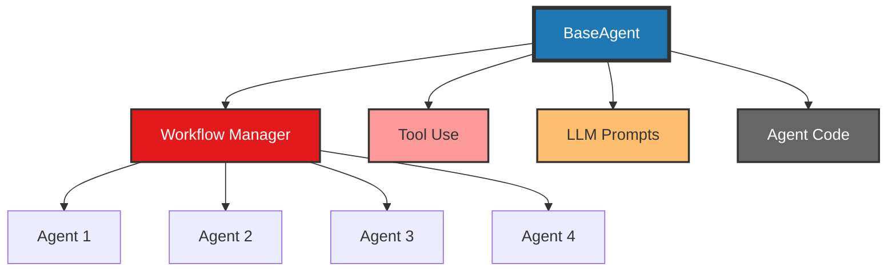
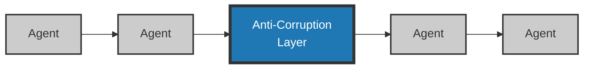
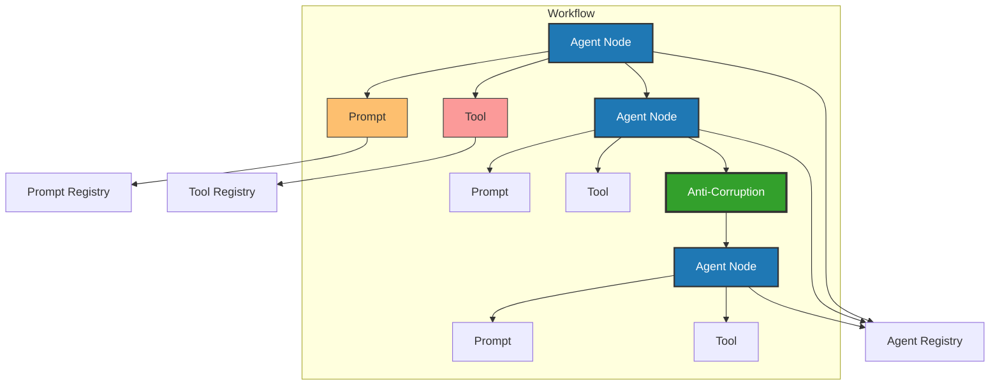
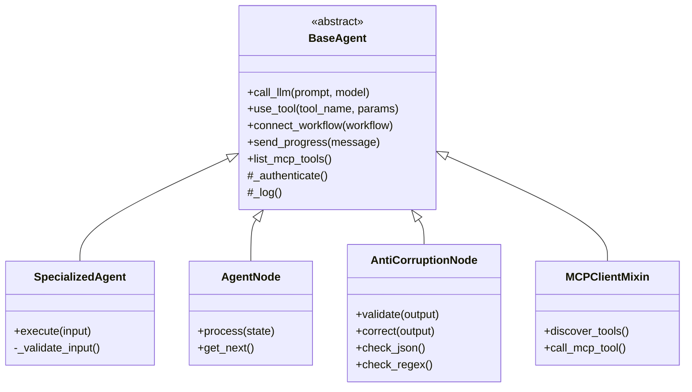
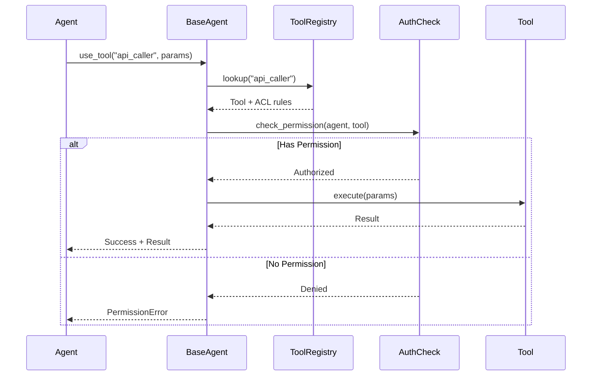
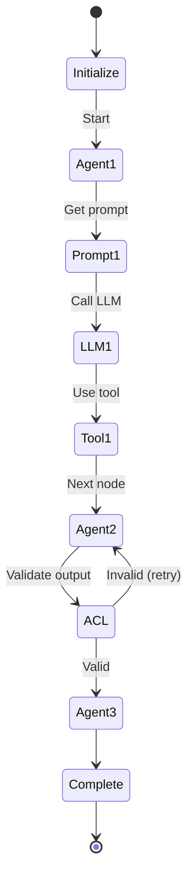

# Agent Framework Extension Plan

**Project**: fips-agents-cli
**Version**: 0.2.0 (Future)
**Date**: October 2025
**Status**: Planning Phase

---

## Executive Summary

This document outlines the plan to extend **fips-agents-cli** from an MCP server scaffolding tool to a comprehensive **enterprise AI agent framework generator**. The extension will enable developers to create production-ready, secure, and compliant AI agent workflows for deployment on Red Hat OpenShift AI.

### Vision

Create a CLI tool that generates:
- **Structured agent workflows** with enforced best practices
- **Enterprise-grade security** with authentication and access control
- **Framework-agnostic** agent code (LangGraph, Swarm, LlamaIndex)
- **Registered and tracked** components (agents, prompts, tools)
- **Anti-corruption layers** for reliable LLM output handling
- **OpenShift AI ready** deployments with FIPS compliance

### Success Criteria

✅ Developers can scaffold complete agent projects in seconds
✅ All agents inherit from BaseAgent for consistency
✅ Prompts and tools are externalized and registered
✅ Tool access control prevents unauthorized usage
✅ Workflows are testable and maintainable
✅ Deployments are secure and compliant

---

## Architecture Principles

### Core Rules (From Your Presentation)

1. **Actions** Must Happen in a Registered Tool
2. **Prompts** Must Be Defined and Registered
3. **LLM Calls** and **Tool Use** Must Use Inherited Methods
4. **Workflows** Must Control the Flow of Execution
5. **Registries** For Everything

### The "No Bare Hands" Philosophy

> "Agents should not do anything with their bare hands"

- ❌ No direct API calls in agent code
- ❌ No database queries in agent logic
- ❌ No file system operations inline
- ✅ All actions go through registered tools
- ✅ Tools can have authentication
- ✅ Tool access is controlled per-agent

### BaseAgent Pattern

```
BaseAgent (Abstract Base Class)
├── call_llm() - Inherited LLM calling
├── use_tool() - Authenticated tool execution
├── connect_workflow() - Workflow integration
├── send_progress() - Progress notifications
└── list_mcp_tools() - MCP client functionality

↓ Inherits

SpecializedAgent (Your Custom Agent)
└── execute() - Your business logic
```

All agents inherit core capabilities, ensuring consistency and reducing boilerplate.

---

## Architecture Diagrams

### 1. BaseAgent Hub Pattern



### 2. Anti-Corruption Layer in Workflow



**Purpose**: Validate and correct probabilistic LLM outputs between workflow stages.

### 3. Component Relationships



### 4. Class Hierarchy



### 5. Tool Access Control Flow



### 6. Workflow Execution Flow



---

## Template Repository Strategy

### Pattern: Mirror MCP Server Approach

Just like **mcp-server-template**, we'll have an **agent-system-template** repository that serves as the foundation for all agent projects.

#### Current Pattern (MCP Servers) ✅

```
mcp-server-template/
├── src/                          # Working code examples
├── .fips-agents-cli/
│   └── generators/               # Jinja2 templates for generating components
│       ├── tool/
│       ├── prompt/
│       ├── resource/
│       └── middleware/
└── ... (tests, configs, best practices)
```

**Workflow:**
1. `fips-agents create mcp-server my-server` → Clones template, customizes
2. `fips-agents generate tool my-tool` → Uses `.fips-agents-cli/generators/tool/` templates
3. Developer implements business logic in generated file

#### New Pattern (Agent Systems) ✅

```
agent-system-template/
├── src/
│   ├── agents/
│   │   └── base/
│   │       └── base_agent.py      # BaseAgent with MCP client built-in
│   ├── workflows/
│   ├── prompts/
│   ├── tools/
│   ├── validators/
│   └── registry/
│       ├── __init__.py            # Auto-imports all registries
│       ├── base.py                # Registry base classes
│       ├── agents.py              # Agent registrations
│       ├── tools.py               # Tool registrations + ACL
│       └── prompts.py             # Prompt registrations
├── .fips-agents-cli/
│   └── generators/                # Jinja2 templates
│       ├── agent/
│       │   ├── react.py.j2        # ReAct pattern
│       │   ├── reflex.py.j2       # Reflex pattern
│       │   ├── goal_based.py.j2   # Goal-based pattern
│       │   └── base.py.j2         # Generic/custom
│       ├── agent-node/
│       ├── workflow/
│       │   ├── linear.py.j2
│       │   ├── hierarchical.py.j2
│       │   └── loop.py.j2
│       ├── agent-prompt/
│       ├── agent-tool/
│       ├── validator/
│       └── anti-corruption-node/
├── config/
│   ├── mcp_servers.yaml           # MCP server connections
│   ├── auth.yaml
│   ├── logging.yaml
│   └── tool_access.yaml
├── examples/                      # Reference implementations
│   ├── react_agent/
│   ├── reflex_agent/
│   ├── hierarchical_workflow/
│   └── multi_agent_system/
└── ...
```

**Same Workflow:**
1. `fips-agents create agent-project my-agents` → Clones template, customizes
2. `fips-agents generate agent my-agent --type react` → Uses Jinja2 templates
3. Developer implements business logic in generated file

### Key Template Features

**1. BaseAgent with MCP Client (Built-In)**
- MCP client is part of BaseAgent core
- Optional to use (configure via `config/mcp_servers.yaml`)
- No separate generator needed
- Always available if agents need remote tools

**2. Separate Registry Files**
- `src/registry/agents.py` - Agent registrations
- `src/registry/tools.py` - Tool registrations + ACL
- `src/registry/prompts.py` - Prompt registrations
- `src/registry/workflows.py` - Workflow registrations
- Auto-imported via `src/registry/__init__.py`

**3. Agent Type Patterns at Generation Time**
- Single template structure
- Pattern-specific code via `--type` flag
- Examples show reference implementations
- Mix patterns in one project

**4. Best Practices Baked In**
- Logging configured (structlog)
- Monitoring hooks ready
- Auth decorators available
- FIPS-compliant containers
- Tests scaffolded

---

## Registry Implementation Strategy

### Decision: Separate Registry Files (Not __init__.py)

After careful consideration, we'll use **separate registry files** with rich metadata, not simple `__init__.py` imports.

#### Why Separate Files?

✅ **Explicit registration with metadata**
```python
# src/registry/tools.py
ToolRegistry.register(
    "api_caller",
    api_caller,
    metadata={
        "description": "Makes external API calls",
        "allowed_agents": ["analyzer_agent", "integration_agent"],
        "require_auth": True,
        "rate_limit": "100/hour"
    }
)
```

✅ **Access control built-in**
```python
if not ToolRegistry.can_use("my_agent", "api_caller"):
    raise PermissionError("Not authorized")
```

✅ **Generator-friendly** - Easy to append registrations
```python
# Generator appends to src/registry/tools.py
code = f"""
ToolRegistry.register("{tool_name}", {tool_name}, metadata={{...}})
"""
```

✅ **Discovery without importing** - Read registry files to see what's available

✅ **Supports enterprise requirements** - Tool access control matrix, audit trail

#### Registry Structure

```
src/registry/
├── __init__.py              # Imports all registries (triggers registration)
├── base.py                  # Registry base classes (AgentRegistry, ToolRegistry, etc.)
├── agents.py                # ✅ Agent registrations with metadata
├── tools.py                 # ✅ Tool registrations + ACL rules
├── prompts.py               # ✅ Prompt registrations
└── workflows.py             # ✅ Workflow registrations
```

#### Auto-Import Pattern

```python
# src/registry/__init__.py
"""Import all registries to trigger registration."""
from .agents import *
from .tools import *
from .prompts import *
from .workflows import *
```

```python
# src/main.py
import registry  # Single import triggers all registrations

# Now everything is registered
agents = AgentRegistry.list_all()
tools = ToolRegistry.list_all()
```

#### What Generators Append

When generating components, CLI appends to appropriate registry file:

```python
# fips-agents generate agent analyzer --type react
# Appends to: src/registry/agents.py

from agents.analyzer import AnalyzerAgent

AgentRegistry.register(
    "analyzer_agent",
    AnalyzerAgent,
    metadata={
        "description": "Analyzes code for issues",  # From --description
        "type": "react",  # From --type flag
        "authorized_tools": []  # User can edit
    }
)
```

---

## MCP Client Strategy

### Decision: Built Into BaseAgent Core (Not a Separate Generator)

The MCP client is **built into BaseAgent** and available to all agents by default.

#### Why Not Generate It?

❌ **Separate generator would be awkward:**
```bash
fips-agents generate mcp-client my-client  # Extra step, inconsistent
```

✅ **Built-in is better:**
- Always available if needed
- Transparent tool usage (local + remote)
- Optional (doesn't activate unless configured)
- Fits "BaseAgent provides everything" philosophy

#### Implementation

```python
# src/agents/base/base_agent.py (in template)

class BaseAgent(ABC):
    def __init__(self):
        self._mcp_client = None

    def connect_mcp_server(self, server_url: str):
        """Connect to MCP server (optional)."""
        self._mcp_client = MCPClient(server_url)

    def use_tool(self, tool_name: str, **kwargs):
        """Use tool (local or MCP - transparent)."""
        # Check local tools first
        if tool_name in self._local_tools:
            return self._execute_local_tool(tool_name, **kwargs)

        # Check MCP tools
        if self._mcp_client and tool_name in self._mcp_tools_cache:
            return self._execute_mcp_tool(tool_name, **kwargs)
```

#### Configuration

```yaml
# config/mcp_servers.yaml (in template)
mcp_servers:
  - name: enterprise_tools
    url: http://mcp.company.com:3000
    auto_connect: true
```

**No generator needed - just configuration!**

---

## Agent Type Patterns Strategy

### Decision: Pattern at Generation Time (Not Separate Templates)

Agent types (ReAct, reflex, goal-based, etc.) are handled via **generator flags**, not separate templates.

#### Why Single Template?

✅ **Directory structure doesn't change** between agent types
✅ **Mix patterns in one project** - ReAct + reflex + goal-based together
✅ **Easier maintenance** - One template structure to update
✅ **Pattern flexibility** - Users customize generated code anyway

#### Pattern-Aware Generation

```bash
# Generate different agent types with --type flag
fips-agents generate agent analyzer --type react        # ReAct pattern
fips-agents generate agent responder --type reflex      # Reflex pattern
fips-agents generate agent planner --type goal-based    # Goal-based pattern
fips-agents generate agent custom --type custom         # Blank canvas
```

#### Template Structure

```
.fips-agents-cli/generators/
├── agent/
│   ├── react.py.j2           # ReAct implementation pattern
│   ├── reflex.py.j2          # Reflex implementation pattern
│   ├── goal_based.py.j2      # Goal-based implementation pattern
│   └── base.py.j2            # Generic/custom pattern
├── workflow/
│   ├── linear.py.j2          # Linear pipeline
│   ├── hierarchical.py.j2    # Supervisor/worker
│   ├── loop.py.j2            # Agent loop with retry
│   └── multi_agent.py.j2     # Multi-agent collaboration
```

Generator selects appropriate template based on `--type` or `--pattern` flag.

#### Reference Examples

```
agent-system-template/examples/
├── react_agent/              # Working example
├── reflex_agent/             # Working example
├── hierarchical_workflow/    # Working example
└── README.md                 # "Choose your pattern" guide
```

Users can reference examples, then generate their own with `--type` flag.

---

## Generator Responsibilities: The Complete Checklist

### Core Value Proposition

> **"Scaffold everything, miss nothing"**

The entire value of generators is that developers can run a single command and get a **complete, working, registered, tested component** with all best practices baked in. They should never have to think "Did I remember to register this?" or "Did I add tests?" or "Did I update the ACL?"

### What Every Generator MUST Do

Every generator follows this comprehensive checklist to ensure nothing is missed:

#### 1. Code Generation
- ✅ Create component file in correct location
- ✅ Use appropriate Jinja2 template based on flags
- ✅ Include all necessary imports
- ✅ Add proper docstrings with Args/Returns/Raises
- ✅ Include TODO comments for business logic
- ✅ Add example usage in comments
- ✅ Follow project coding standards (Black, Ruff compliant)

#### 2. Registry Updates
- ✅ Append registration to appropriate registry file
- ✅ Include rich metadata (description, type, etc.)
- ✅ Add access control rules (for tools)
- ✅ Use correct registry class (AgentRegistry, ToolRegistry, etc.)
- ✅ Import the component in registry file

#### 3. Test Generation
- ✅ Create test file in correct test directory
- ✅ Mirror source structure (`tests/agents/test_analyzer.py` for `src/agents/analyzer.py`)
- ✅ Include basic test cases (success, failure, edge cases)
- ✅ Use appropriate test framework (pytest)
- ✅ Add fixtures if needed
- ✅ Include TODO comments for additional test cases

#### 4. Configuration Updates (If Applicable)
- ✅ Update `config/tool_access.yaml` for tools with auth
- ✅ Add MCP server entries if using remote tools
- ✅ Update auth config if authentication required
- ✅ Add logging configuration if special logging needed

#### 5. Documentation
- ✅ Update README if needed (for major components)
- ✅ Add inline comments explaining patterns
- ✅ Include Mermaid diagrams in workflow comments
- ✅ Document any special configuration needed

#### 6. Validation
- ✅ Validate generated code syntax (ast.parse)
- ✅ Check imports are available
- ✅ Verify no duplicate registrations
- ✅ Confirm file doesn't already exist

#### 7. User Feedback
- ✅ Show success message with next steps
- ✅ Indicate which files were created/modified
- ✅ Provide example usage
- ✅ Show how to run tests
- ✅ Warn about TODOs that need attention

### Generator-Specific Checklists

#### `generate agent` Checklist

When running: `fips-agents generate agent analyzer --type react --tools api_caller,db_query`

**Must create:**
1. ✅ `src/agents/analyzer.py` - Agent implementation
   - Inherits from BaseAgent (or specified base)
   - Implements `execute()` method with ReAct pattern
   - Includes tool authorization checks
   - Has proper docstrings

2. ✅ `tests/agents/test_analyzer.py` - Tests
   - Test `execute()` with mock inputs
   - Test error handling
   - Test tool usage
   - Test state management (if stateful)

3. ✅ Append to `src/registry/agents.py` - Registration
   ```python
   from agents.analyzer import AnalyzerAgent

   AgentRegistry.register(
       "analyzer_agent",
       AnalyzerAgent,
       metadata={
           "description": "Analyzes code for issues",
           "type": "react",
           "base_class": "BaseAgent",
           "authorized_tools": ["api_caller", "db_query"],
           "created_at": "2025-10-14"
       }
   )
   ```

**Must validate:**
- Agent name is valid Python identifier
- Base class exists (if specified)
- Tools exist in ToolRegistry (if specified)
- No duplicate agent name

**Must inform user:**
```
✓ Successfully generated react agent!

Files Created:
  • src/agents/analyzer.py
  • tests/agents/test_analyzer.py

Registry Updated:
  • src/registry/agents.py

Next Steps:
  1. Implement business logic in execute()
  2. Update docstrings with specific details
  3. Run tests: pytest tests/agents/test_analyzer.py
  4. Register authorized tools if needed

Authorized Tools:
  • api_caller
  • db_query

Pattern: ReAct (Reasoning + Acting)
Example usage in comments at top of analyzer.py
```

#### `generate agent-tool` Checklist

When running: `fips-agents generate agent-tool api_caller --with-auth --allowed-agents analyzer,reviewer`

**Must create:**
1. ✅ `src/tools/api_caller.py` - Tool implementation
   - Function signature with type hints
   - Authentication decorator (if `--with-auth`)
   - Error handling
   - Docstrings with examples

2. ✅ `tests/tools/test_api_caller.py` - Tests
   - Test successful execution
   - Test auth enforcement
   - Test error cases
   - Mock external dependencies

3. ✅ Append to `src/registry/tools.py` - Registration with ACL
   ```python
   from tools.api_caller import api_caller

   ToolRegistry.register(
       "api_caller",
       api_caller,
       metadata={
           "description": "Makes external API calls",
           "allowed_agents": ["analyzer_agent", "reviewer_agent"],
           "require_auth": True,
           "rate_limit": "100/hour",
           "tags": ["external", "network"],
           "created_at": "2025-10-14"
       }
   )
   ```

4. ✅ Update `config/tool_access.yaml` - ACL configuration
   ```yaml
   tools:
     api_caller:
       allowed_agents:
         - analyzer_agent
         - reviewer_agent
       require_auth: true
       rate_limit: 100/hour
   ```

**Must validate:**
- Tool name is valid Python identifier
- Allowed agents exist in AgentRegistry
- No duplicate tool name

**Must inform user:**
```
✓ Successfully generated agent tool!

Files Created:
  • src/tools/api_caller.py
  • tests/tools/test_api_caller.py

Registry Updated:
  • src/registry/tools.py

Configuration Updated:
  • config/tool_access.yaml

Access Control:
  Allowed agents: analyzer_agent, reviewer_agent
  Authentication: Required

Next Steps:
  1. Implement tool logic in api_caller()
  2. Add proper error handling
  3. Test with: pytest tests/tools/test_api_caller.py
  4. Verify auth works as expected

Security Note:
  This tool requires authentication and has access control.
  Only authorized agents can use it.
```

#### `generate agent-prompt` Checklist

When running: `fips-agents generate agent-prompt analyze_code --with-baml --output-schema schema.json`

**Must create:**
1. ✅ `src/prompts/analyze_code.py` - Python wrapper (if BAML)
2. ✅ `baml_src/analyze_code.baml` - BAML definition (if `--with-baml`)
3. ✅ `tests/prompts/test_analyze_code.py` - Tests

4. ✅ Append to `src/registry/prompts.py` - Registration
   ```python
   from prompts.analyze_code import analyze_code_prompt

   PromptRegistry.register(
       "analyze_code_prompt",
       analyze_code_prompt,
       metadata={
           "description": "Analyzes code structure and quality",
           "uses_baml": True,
           "output_type": "structured",
           "tags": ["code", "analysis"],
           "created_at": "2025-10-14"
       }
   )
   ```

**Must validate:**
- Prompt name is valid
- Output schema is valid JSON (if provided)
- BAML dependencies installed (if `--with-baml`)

#### `generate workflow` Checklist

When running: `fips-agents generate workflow review_pipeline --pattern linear --nodes input,analyze,review,output`

**Must create:**
1. ✅ `src/workflows/review_pipeline.py` - Workflow implementation
   - Uses appropriate framework (LangGraph, Swarm, etc.)
   - Includes all specified nodes
   - Has proper state management
   - Includes Mermaid diagram in comments

2. ✅ `tests/workflows/test_review_pipeline.py` - Tests
   - Test end-to-end execution
   - Test node transitions
   - Test error handling
   - Test state management

3. ✅ Append to `src/registry/workflows.py` - Registration
   ```python
   from workflows.review_pipeline import review_pipeline_workflow

   WorkflowRegistry.register(
       "review_pipeline",
       review_pipeline_workflow,
       metadata={
           "description": "Code review pipeline",
           "pattern": "linear",
           "nodes": ["input", "analyze", "review", "output"],
           "framework": "langgraph",
           "created_at": "2025-10-14"
       }
   )
   ```

**Must validate:**
- Workflow name is valid
- All specified nodes exist as agent nodes
- Pattern is supported
- Framework is available

**Must inform user:**
```
✓ Successfully generated linear workflow!

Files Created:
  • src/workflows/review_pipeline.py
  • tests/workflows/test_review_pipeline.py

Registry Updated:
  • src/registry/workflows.py

Workflow Details:
  Pattern: Linear pipeline
  Nodes: input → analyze → review → output
  Framework: LangGraph

Next Steps:
  1. Review generated workflow structure
  2. Ensure all nodes are implemented
  3. Test with: pytest tests/workflows/test_review_pipeline.py
  4. View workflow diagram in comments

Mermaid Diagram:
  See workflow file header for visual representation
```

#### `generate validator` Checklist

Similar pattern - creates validator, tests, registers it, validates input.

### Common Validation Checks (All Generators)

Before generating, **every generator must:**

1. ✅ Check if in agent project (look for `src/registry/` directory)
2. ✅ Validate component name (snake_case, valid identifier)
3. ✅ Check for name collisions (component doesn't already exist)
4. ✅ Verify dependencies (framework available, BAML installed if needed)
5. ✅ Check generator templates exist
6. ✅ Validate any provided schemas/configs

After generating, **every generator must:**

1. ✅ Validate generated code syntax (ast.parse)
2. ✅ Verify all imports are valid
3. ✅ Check registry registration worked
4. ✅ Run basic lint checks (if possible)
5. ✅ Provide clear next steps

### Error Handling Standards

All generators must provide helpful errors:

```python
# Bad
❌ "Error: Failed"

# Good
✓ "Component 'api_caller' already exists at src/tools/api_caller.py

  Hint: Choose a different name or remove the existing file.

  To view existing tools: fips-agents list tools"
```

### Generator Output Template

Every generator should follow this output pattern:

```
[Component Type] Generation

✓ Component name 'my_component' is valid
✓ Generator templates found
✓ [Additional validation checks...]

Generating component files...
✓ Generated code passed syntax validation
✓ Created: src/[type]/my_component.py
✓ Created: tests/[type]/test_my_component.py
✓ Updated: src/registry/[type]s.py

[Optional: Configuration updates]
✓ Updated: config/tool_access.yaml

╭──────────────────────────────────────────────╮
│                                              │
│  ✓ Successfully generated [type]!            │
│                                              │
│  Files Created:                              │
│    • src/[type]/my_component.py              │
│    • tests/[type]/test_my_component.py       │
│                                              │
│  Registry Updated:                           │
│    • src/registry/[type]s.py                 │
│                                              │
│  [Component-specific info]                   │
│                                              │
│  Next Steps:                                 │
│    1. [Specific step 1]                      │
│    2. [Specific step 2]                      │
│    3. Run tests: pytest tests/[...]          │
│                                              │
│  [Additional notes/warnings if needed]       │
│                                              │
╰──────────────────────────────────────────────╯
```

---

## Generatable Components

### Component Type Matrix

| Component | Command | Purpose | Framework-Specific |
|-----------|---------|---------|-------------------|
| **Agent Project** | `create agent-project` | Scaffold complete project | Yes |
| **Base Agent** | `generate base-agent` | Abstract base class | Yes |
| **Agent** | `generate agent` | Specialized agent | Yes |
| **Agent Node** | `generate agent-node` | Workflow node | Yes |
| **Workflow** | `generate workflow` | Orchestration | Yes |
| **Agent Prompt** | `generate agent-prompt` | LLM prompt (with BAML) | No |
| **Agent Tool** | `generate agent-tool` | Executable tool | No |
| **Validator** | `generate validator` | Output validator | No |
| **Anti-Corruption Node** | `generate anti-corruption-node` | Validation node | Yes |
| **MCP Client** | `generate mcp-client` | Remote tool access | No |

### Detailed Command Specifications

#### 1. Create Agent Project

```bash
fips-agents create agent-project <name> [options]

Options:
  --framework [langgraph|swarm|llamaindex|llamastack]  (default: langgraph)
  --target-dir <path>                                   (default: .)
  --with-auth                                           Include auth templates
  --with-monitoring                                     Include monitoring setup
  --fips-compliant                                      FIPS mode
  --no-git                                              Skip git init
```

**Generates:**
```
<name>/
├── src/
│   ├── agents/
│   │   └── base/
│   │       └── base_agent.py
│   ├── workflows/
│   ├── prompts/
│   ├── tools/
│   ├── validators/
│   └── registry/
│       ├── __init__.py
│       ├── agents.py
│       ├── prompts.py
│       └── tools.py
├── baml_src/                    # If using BAML
├── config/
│   ├── auth.yaml
│   ├── logging.yaml
│   └── tool_access.yaml
├── tests/
├── pyproject.toml
├── README.md
└── .gitignore
```

#### 2. Generate Base Agent

```bash
fips-agents generate base-agent <name> [options]

Options:
  --with-mcp-client     Include MCP client functionality
  --with-progress       Include progress notifications
  --async               Generate async base methods
```

**Generates:**
- `src/agents/base/<name>.py` - Abstract base class
- `tests/agents/test_<name>.py` - Base tests

**Key Features:**
- Abstract `execute()` method
- Concrete `call_llm()`, `use_tool()`, `send_progress()`
- Authentication hooks
- Logging integration
- Tool access control enforcement

#### 3. Generate Agent

```bash
fips-agents generate agent <name> [options]

Options:
  --base <BaseClass>               Base agent class (default: BaseAgent)
  --with-state                     Include state management
  --prompt <prompt_name>           Link to registered prompt
  --tools <tool1,tool2>            Authorize specific tools
  --description "Description"
```

**Generates:**
- `src/agents/<name>.py` - Agent implementation
- `tests/agents/test_<name>.py` - Agent tests
- Updates `src/registry/agents.py` - Registration entry

#### 4. Generate Agent Node

```bash
fips-agents generate agent-node <name> [options]

Options:
  --base <BaseClass>               Base agent class
  --input-schema <path>            JSON schema for input
  --output-schema <path>           JSON schema for output
  --stateful                       Node maintains state
```

**For LangGraph:**
```python
def <name>_node(state: State) -> dict:
    """Node implementation."""
    agent = <Name>Agent()
    result = agent.process(state)
    return {"<key>": result}
```

#### 5. Generate Workflow

```bash
fips-agents generate workflow <name> [options]

Options:
  --framework [langgraph|swarm|llamaindex]
  --nodes <node1,node2,node3>      Initial nodes
  --with-anti-corruption           Add ACL node
  --entry-point <node>             Starting node
```

**Generates:**
- `src/workflows/<name>.py` - Workflow definition
- `tests/workflows/test_<name>.py` - Workflow tests
- Mermaid diagram in comments

#### 6. Generate Agent Prompt

```bash
fips-agents generate agent-prompt <name> [options]

Options:
  --with-baml                      Use BAML for structured output
  --output-schema <path>           Expected output structure
  --system-message "Message"       System prompt
  --few-shot <path>                Few-shot examples
```

**Without BAML:**
```python
# src/prompts/<name>.py
def <name>_prompt(context: dict) -> str:
    return f"""System: You are...

User: {context['input']}"""
```

**With BAML:**
```baml
# baml_src/<name>.baml
class <Name>Input {
  context string
}

class <Name>Output {
  result string
  confidence float
}

function <Name>(input: <Name>Input) -> <Name>Output {
  client GPT4
  prompt #"..."#
}
```

#### 7. Generate Agent Tool

```bash
fips-agents generate agent-tool <name> [options]

Options:
  --with-auth                      Require authentication
  --allowed-agents <a1,a2>         Whitelist agents
  --api-endpoint <url>             External API
  --retry-policy <policy>          Retry configuration
```

**Generates:**
- `src/tools/<name>.py` - Tool implementation
- `tests/tools/test_<name>.py` - Tool tests
- Updates `src/registry/tools.py` - Registration + ACL
- Updates `config/tool_access.yaml` - Access control

#### 8. Generate Validator

```bash
fips-agents generate validator <name> [options]

Options:
  --type [regex|json|llm|content|custom]
  --schema <path>                  For JSON validation
  --pattern <regex>                For regex validation
  --max-length <n>                 For content validation
```

**Generates:**
- `src/validators/<name>.py` - Validator logic
- `tests/validators/test_<name>.py` - Validator tests

#### 9. Generate Anti-Corruption Node

```bash
fips-agents generate anti-corruption-node <name> [options]

Options:
  --validators <v1,v2>             Validators to apply
  --correction-strategy [retry|llm|fail]
  --max-retries <n>
```

**Generates:**
- `src/agents/anti_corruption/<name>.py` - ACL node
- Integrates with workflow
- Uses registered validators

#### 10. Generate MCP Client

```bash
fips-agents generate mcp-client <name> [options]

Options:
  --server-url <url>               MCP server URL
  --auth-method [oauth|apikey]
  --tool-discovery                 Auto-discover tools
```

**Generates:**
- `src/mcp/<name>_client.py` - MCP client wrapper
- Integration with BaseAgent
- Tool discovery mechanism

---

## Project Structure

### Agent Project Layout

```
my-agent-project/
├── src/
│   ├── __init__.py
│   │
│   ├── agents/
│   │   ├── __init__.py
│   │   ├── base/
│   │   │   ├── __init__.py
│   │   │   └── base_agent.py          # Abstract base class
│   │   ├── specialized/
│   │   │   ├── __init__.py
│   │   │   ├── analyzer.py            # Specialized agents
│   │   │   └── reviewer.py
│   │   ├── nodes/
│   │   │   ├── __init__.py
│   │   │   ├── input_node.py          # Workflow nodes
│   │   │   ├── process_node.py
│   │   │   └── output_node.py
│   │   └── anti_corruption/
│   │       ├── __init__.py
│   │       └── validator_node.py
│   │
│   ├── workflows/
│   │   ├── __init__.py
│   │   └── main_workflow.py           # LangGraph/Swarm workflows
│   │
│   ├── prompts/
│   │   ├── __init__.py
│   │   ├── analyze_prompt.py          # Prompt definitions
│   │   └── review_prompt.py
│   │
│   ├── tools/
│   │   ├── __init__.py
│   │   ├── api_caller.py              # Tool implementations
│   │   ├── db_query.py
│   │   └── file_processor.py
│   │
│   ├── validators/
│   │   ├── __init__.py
│   │   ├── json_validator.py          # Output validators
│   │   ├── regex_validator.py
│   │   └── content_validator.py
│   │
│   ├── mcp/
│   │   ├── __init__.py
│   │   └── remote_client.py           # MCP client for remote tools
│   │
│   ├── registry/
│   │   ├── __init__.py
│   │   ├── agents.py                  # Agent registry
│   │   ├── prompts.py                 # Prompt registry
│   │   ├── tools.py                   # Tool registry
│   │   └── workflows.py               # Workflow registry
│   │
│   ├── core/
│   │   ├── __init__.py
│   │   ├── auth.py                    # Authentication
│   │   ├── logging.py                 # Logging setup
│   │   └── monitoring.py              # Monitoring hooks
│   │
│   └── main.py                        # Entry point
│
├── baml_src/                          # BAML prompt definitions
│   ├── analyze.baml
│   └── review.baml
│
├── config/
│   ├── auth.yaml                      # Auth configuration
│   ├── logging.yaml                   # Logging config
│   ├── tool_access.yaml               # Tool ACLs
│   └── deployment.yaml                # OpenShift deployment
│
├── tests/
│   ├── agents/
│   ├── workflows/
│   ├── prompts/
│   ├── tools/
│   └── validators/
│
├── docs/
│   ├── architecture.md
│   ├── workflows.md
│   └── deployment.md
│
├── Containerfile                      # OpenShift container
├── pyproject.toml
├── README.md
└── .gitignore
```

---

## Framework Abstraction Strategy

### Multi-Framework Support

Users can choose their preferred framework at project creation time. The CLI generates framework-specific code while maintaining consistent interfaces.

#### Supported Frameworks

1. **LangGraph** (Primary, Default)
   - State-based workflows
   - Graph-based agent orchestration
   - Conditional routing
   - Checkpointing

2. **Swarm** (OpenAI)
   - Function-based agents
   - Handoff patterns
   - Lightweight

3. **LlamaIndex**
   - Query engines
   - Data agents
   - RAG workflows

4. **LlamaStack** (OpenShift AI)
   - Deployment-optimized
   - Enterprise features
   - FIPS compliant

#### Framework Adapter Pattern

```python
# src/core/framework_adapter.py

class FrameworkAdapter(ABC):
    """Abstract adapter for different agent frameworks."""

    @abstractmethod
    def create_agent(self, config):
        pass

    @abstractmethod
    def create_workflow(self, nodes):
        pass

    @abstractmethod
    def execute_workflow(self, workflow, input_data):
        pass

class LangGraphAdapter(FrameworkAdapter):
    """LangGraph implementation."""
    pass

class SwarmAdapter(FrameworkAdapter):
    """Swarm implementation."""
    pass
```

#### Conditional Generation

Templates use framework-specific blocks:

```jinja2

from langgraph.graph import StateGraph, END

from swarm import Swarm, Agent

from llama_index.core.agent import ReActAgent

```

---

## Security & Enterprise Features

### 1. Tool Authentication

```python
# src/core/auth.py

def requires_auth(allowed_agents: list[str]):
    """Decorator to enforce tool access control."""
    def decorator(func):
        @wraps(func)
        def wrapper(agent_id: str, *args, **kwargs):
            if agent_id not in allowed_agents:
                raise PermissionError(f"Agent {agent_id} not authorized")
            return func(*args, **kwargs)
        return wrapper
    return decorator

# Usage in tool
@requires_auth(["analyzer_agent", "reviewer_agent"])
def call_api(endpoint: str, params: dict):
    """Make API call."""
    pass
```

### 2. Tool Access Control Matrix

```yaml
# config/tool_access.yaml

tools:
  api_caller:
    allowed_agents:
      - analyzer_agent
      - integration_agent
    require_auth: true
    rate_limit: 100/hour

  db_query:
    allowed_agents:
      - data_agent
    require_auth: true
    read_only: true

  file_processor:
    allowed_agents:
      - *  # All agents
    require_auth: false
```

### 3. Logging Standards

```python
# src/core/logging.py

import structlog

def setup_logging():
    """Configure structured logging."""
    structlog.configure(
        processors=[
            structlog.processors.add_log_level,
            structlog.processors.TimeStamper(fmt="iso"),
            structlog.processors.JSONRenderer()
        ]
    )

# Usage in agents
logger = structlog.get_logger()

class BaseAgent:
    def call_llm(self, prompt):
        logger.info("llm_call_started",
                    agent=self.__class__.__name__,
                    prompt_length=len(prompt))
        # ... make call
        logger.info("llm_call_completed", tokens_used=result.tokens)
```

### 4. Monitoring Hooks

```python
# src/core/monitoring.py

class MonitoringMixin:
    """Mixin for agent monitoring."""

    def send_metric(self, metric_name: str, value: float):
        """Send metric to monitoring system."""
        # Prometheus, StatsD, or OpenShift monitoring
        pass

    def track_execution_time(self, operation: str):
        """Decorator to track operation timing."""
        def decorator(func):
            @wraps(func)
            def wrapper(*args, **kwargs):
                start = time.time()
                result = func(*args, **kwargs)
                duration = time.time() - start
                self.send_metric(f"{operation}_duration", duration)
                return result
            return wrapper
        return decorator
```

### 5. FIPS Compliance

- Use FIPS-validated cryptographic modules
- Red Hat UBI base images
- Proper certificate handling
- Audit logging

---

## Registration System Design

### Purpose

Track all agents, prompts, tools, and workflows for:
- Discovery
- Access control
- Monitoring
- Documentation

### Registry Pattern

```python
# src/registry/base.py

class Registry(ABC):
    """Base registry for all components."""

    _items: dict[str, Any] = {}

    @classmethod
    def register(cls, name: str, item: Any, metadata: dict = None):
        """Register a component."""
        cls._items[name] = {
            "item": item,
            "metadata": metadata or {},
            "registered_at": datetime.now()
        }

    @classmethod
    def get(cls, name: str) -> Any:
        """Retrieve registered component."""
        if name not in cls._items:
            raise KeyError(f"{name} not registered")
        return cls._items[name]["item"]

    @classmethod
    def list_all(cls) -> list[str]:
        """List all registered items."""
        return list(cls._items.keys())
```

### Agent Registry

```python
# src/registry/agents.py

from .base import Registry

class AgentRegistry(Registry):
    """Registry for agents."""
    pass

# Registration (auto-generated in agent files)
AgentRegistry.register(
    "analyzer_agent",
    AnalyzerAgent,
    metadata={
        "description": "Analyzes code for issues",
        "base_class": "BaseAgent",
        "authorized_tools": ["api_caller", "db_query"]
    }
)
```

### Tool Registry with ACL

```python
# src/registry/tools.py

from .base import Registry

class ToolRegistry(Registry):
    """Registry for tools with access control."""

    @classmethod
    def can_use(cls, agent_id: str, tool_name: str) -> bool:
        """Check if agent can use tool."""
        tool_info = cls._items.get(tool_name)
        if not tool_info:
            return False

        allowed = tool_info["metadata"].get("allowed_agents", [])
        return "*" in allowed or agent_id in allowed
```

### Prompt Registry

```python
# src/registry/prompts.py

from .base import Registry

class PromptRegistry(Registry):
    """Registry for prompts."""

    @classmethod
    def get_prompt(cls, name: str, context: dict) -> str:
        """Get rendered prompt."""
        prompt_func = cls.get(name)
        return prompt_func(context)
```

---

## Anti-Corruption Layer Design

### Validator Types

#### 1. JSON Validator

```python
# src/validators/json_validator.py

class JSONValidator:
    """Validate and correct JSON outputs."""

    def validate(self, output: str, schema: dict = None) -> tuple[bool, Any]:
        """Validate JSON string."""
        try:
            data = json.loads(output)
            if schema:
                jsonschema.validate(data, schema)
            return True, data
        except (json.JSONDecodeError, jsonschema.ValidationError) as e:
            return False, str(e)

    def correct(self, output: str) -> str:
        """Attempt to fix malformed JSON."""
        # Remove markdown code blocks
        output = re.sub(r'```json\n?', '', output)
        output = re.sub(r'```\n?', '', output)

        # Try to extract JSON
        match = re.search(r'\{.*\}', output, re.DOTALL)
        if match:
            return match.group(0)

        return output
```

#### 2. Regex Validator

```python
# src/validators/regex_validator.py

class RegexValidator:
    """Validate outputs against regex patterns."""

    def __init__(self, pattern: str):
        self.pattern = re.compile(pattern)

    def validate(self, output: str) -> bool:
        """Check if output matches pattern."""
        return bool(self.pattern.search(output))
```

#### 3. LLM Validator

```python
# src/validators/llm_validator.py

class LLMValidator:
    """Use LLM to validate another LLM's output."""

    def validate(self, output: str, expected_format: str) -> tuple[bool, str]:
        """Ask LLM to validate output."""
        validation_prompt = f"""
        Validate this output matches the expected format:

        Expected: {expected_format}
        Output: {output}

        Respond with: VALID or INVALID|reason
        """

        result = call_llm(validation_prompt)

        if result.startswith("VALID"):
            return True, "Output is valid"
        else:
            return False, result.split("|")[1]
```

### Anti-Corruption Node

```python
# src/agents/anti_corruption/validator_node.py

class AntiCorruptionNode(BaseAgent):
    """Validates and corrects agent outputs."""

    def __init__(self, validators: list, max_retries: int = 3):
        super().__init__()
        self.validators = validators
        self.max_retries = max_retries

    def process(self, state: dict) -> dict:
        """Validate and correct output."""
        output = state.get("output")

        for validator in self.validators:
            is_valid, result = validator.validate(output)

            if not is_valid:
                logger.warning(f"Validation failed: {result}")

                # Attempt correction
                if hasattr(validator, "correct"):
                    corrected = validator.correct(output)
                    state["output"] = corrected
                    state["corrected"] = True
                else:
                    state["validation_error"] = result
                    state["retry_needed"] = True

        return state
```

### Integration in Workflow

```python
# LangGraph workflow with ACL
from langgraph.graph import StateGraph, END

workflow = StateGraph(State)

workflow.add_node("agent1", agent1_node)
workflow.add_node("anti_corruption", anti_corruption_node)
workflow.add_node("agent2", agent2_node)

workflow.add_edge("agent1", "anti_corruption")
workflow.add_conditional_edges(
    "anti_corruption",
    lambda state: "retry" if state.get("retry_needed") else "proceed",
    {
        "retry": "agent1",
        "proceed": "agent2"
    }
)

workflow.set_entry_point("agent1")
```

---

## MCP Integration

### MCP Client in BaseAgent

```python
# src/agents/base/base_agent.py

class BaseAgent(ABC):
    """Base class for all agents."""

    def __init__(self):
        self.mcp_client = None

    def connect_mcp_server(self, server_url: str):
        """Connect to MCP server for remote tools."""
        self.mcp_client = MCPClient(server_url)
        self.mcp_client.connect()

    def list_mcp_tools(self) -> list[str]:
        """Discover available MCP tools."""
        if not self.mcp_client:
            return []
        return self.mcp_client.list_tools()

    def use_mcp_tool(self, tool_name: str, params: dict):
        """Execute remote MCP tool."""
        if not self.mcp_client:
            raise RuntimeError("MCP client not connected")

        logger.info(f"Calling MCP tool: {tool_name}")
        result = self.mcp_client.call_tool(tool_name, params)
        return result
```

### Tool Discovery

```python
# src/mcp/discovery.py

class MCPToolDiscovery:
    """Discover and register MCP tools."""

    def discover_from_server(self, server_url: str):
        """Discover tools from MCP server."""
        client = MCPClient(server_url)
        tools = client.list_tools()

        for tool in tools:
            # Register as available tool
            ToolRegistry.register(
                f"mcp_{tool['name']}",
                lambda **kwargs: client.call_tool(tool['name'], kwargs),
                metadata={
                    "source": "mcp",
                    "server": server_url,
                    "description": tool.get("description", "")
                }
            )
```

### Mixing Local and Remote Tools

```python
# Agent can use both
class MyAgent(BaseAgent):
    def execute(self, input_data):
        # Use local tool
        local_result = self.use_tool("local_processor", input_data)

        # Use MCP tool
        remote_result = self.use_mcp_tool("remote_analyzer", local_result)

        return remote_result
```

---

## BAML Integration Strategy

### When to Use BAML

✅ **Use BAML for:**
- Agent prompts (direct LLM calls)
- Structured output requirements
- Type-safe LLM interactions
- Complex validation needs

❌ **Don't use BAML for:**
- MCP prompts (they return text, not call LLMs)
- Simple string templates
- Non-LLM workflows

### Optional BAML Generation

```bash
# Without BAML (simple)
fips-agents generate agent-prompt analyze_code

# With BAML (structured)
fips-agents generate agent-prompt analyze_code --with-baml --output-schema schema.json
```

### Generated Structure (with BAML)

```
src/
├── prompts/
│   └── analyze_code.py         # Python wrapper
└── ...

baml_src/
└── analyze_code.baml           # BAML definition
```

### Python Wrapper

```python
# src/prompts/analyze_code.py

from baml_client import b

def analyze_code_prompt(code: str, language: str) -> dict:
    """Analyze code using BAML-powered structured output."""
    result = b.AnalyzeCode(
        AnalyzeCodeInput(code=code, language=language)
    )

    return {
        "complexity_score": result.complexity_score,
        "issues": result.issues,
        "suggestions": result.suggestions
    }
```

### BAML Definition

```baml
# baml_src/analyze_code.baml

class AnalyzeCodeInput {
  code string
  language string
}

class CodeIssue {
  line int
  severity "low" | "medium" | "high"
  description string
}

class AnalyzeCodeOutput {
  complexity_score int @description("1-10 rating")
  issues CodeIssue[]
  suggestions string[]
  next_action "refactor" | "approve" | "reject"
}

function AnalyzeCode(input: AnalyzeCodeInput) -> AnalyzeCodeOutput {
  client GPT4
  prompt #"
    Analyze this {{ input.language }} code:

    ```{{ input.language }}
    {{ input.code }}
    ```

    Rate complexity (1-10), identify issues, and recommend action.
  "#
}
```

---

## Phased Implementation Plan

### Phase 1: Foundation (MVP) - 4-6 weeks

**Goal**: Basic LangGraph agent scaffolding with BaseAgent pattern

**Deliverables:**
- ✅ `create agent-project` command (LangGraph only)
- ✅ `generate base-agent` command
- ✅ `generate agent` command
- ✅ `generate agent-node` command
- ✅ `generate workflow` command (simple)
- ✅ `generate agent-prompt` command (no BAML)
- ✅ `generate agent-tool` command (no auth)
- ✅ Basic registry system
- ✅ Project structure templates
- ✅ Documentation

**Success Criteria:**
- Can create a working LangGraph workflow
- Agents inherit from BaseAgent
- Prompts and tools are external
- Tests pass

### Phase 2: Security & Registration - 3-4 weeks

**Goal**: Enterprise-ready with auth and tracking

**Deliverables:**
- ✅ Tool authentication (`--with-auth`)
- ✅ Access control system
- ✅ `config/tool_access.yaml` support
- ✅ Enhanced registration with metadata
- ✅ Logging integration
- ✅ Monitoring hooks
- ✅ `generate validator` command
- ✅ `generate anti-corruption-node` command

**Success Criteria:**
- Tools enforce access control
- All components properly registered
- Structured logging works
- Validators can be chained

### Phase 3: Multi-Framework & MCP - 4-5 weeks

**Goal**: Support multiple frameworks and MCP integration

**Deliverables:**
- ✅ Swarm framework support
- ✅ LlamaIndex framework support
- ✅ Framework adapter pattern
- ✅ `generate mcp-client` command
- ✅ MCP tool discovery
- ✅ Mixed local/remote tool usage
- ✅ Framework-specific templates

**Success Criteria:**
- Can choose framework at creation
- MCP tools usable from agents
- Tool discovery works
- Framework switching is clean

### Phase 4: BAML & Advanced Features - 3-4 weeks

**Goal**: Structured outputs and advanced capabilities

**Deliverables:**
- ✅ BAML integration (`--with-baml` flag)
- ✅ Structured output schemas
- ✅ LlamaStack adapter (OpenShift AI)
- ✅ FIPS-compliant templates
- ✅ Advanced anti-corruption strategies
- ✅ Performance monitoring
- ✅ OpenShift deployment configs

**Success Criteria:**
- BAML prompts generate correctly
- OpenShift deployment works
- FIPS compliance verified
- Production-ready templates

### Phase 5: Polish & Documentation - 2-3 weeks

**Goal**: Production readiness

**Deliverables:**
- ✅ Comprehensive documentation
- ✅ Example projects
- ✅ Best practices guide
- ✅ Migration guide (MCP → Agents)
- ✅ Troubleshooting guide
- ✅ Performance optimization
- ✅ Security audit

**Success Criteria:**
- Documentation complete
- Examples work out-of-box
- Security review passed
- Ready for 1.0 release

---

## Comparison: MCP Projects vs Agent Projects

| Aspect | MCP Projects | Agent Projects |
|--------|-------------|----------------|
| **Purpose** | Provide tools/prompts to MCP clients | Build autonomous agent workflows |
| **Architecture** | Server responds to requests | Agents orchestrate work |
| **LLM Calls** | Client calls LLM | Agents call LLMs directly |
| **Prompts** | Return text to client | Execute with LLMs |
| **Tools** | Exposed via MCP protocol | Called internally |
| **Workflows** | N/A | Required |
| **State** | Stateless | Stateful workflows |
| **Deployment** | Standalone server | Application |
| **Use Case** | Extend Claude Desktop | Build AI applications |
| **BAML** | ❌ No (wrong pattern) | ✅ Yes (perfect fit) |
| **Security** | MCP protocol auth | Tool-level + agent-level |
| **Example** | File search tool | Code review workflow |

### When to Use Each

**Use MCP Projects when:**
- Building reusable tools for LLM clients
- Integrating with Claude Desktop or other MCP clients
- Providing stateless operations
- Need broad compatibility

**Use Agent Projects when:**
- Building autonomous workflows
- Need stateful multi-step processes
- Orchestrating multiple LLMs and tools
- Deploying as standalone application
- Require complex validation and error handling

### Hybrid Approach

You can combine both:
```
my-enterprise-project/
├── mcp-server/          # MCP server exposing tools
└── agent-workflow/      # Agent using MCP tools
```

Agent workflows can consume MCP servers as tool sources!

---

## Open Questions & Decisions Needed

### Framework Questions

1. **LangGraph State Schema**
   - Should we enforce TypedDict for state?
   - Or allow flexible dict-based state?
   - **Recommendation**: Start with TypedDict for type safety

2. **Swarm Integration Depth**
   - Full Swarm API support or basic patterns?
   - **Recommendation**: Basic patterns (MVP), expand later

3. **LlamaIndex Query Engine**
   - Focus on agents or query engines?
   - **Recommendation**: Agents first, query engines Phase 3

### Deployment Questions

4. **OpenShift AI Specifics**
   - LlamaStack integration requirements?
   - Model serving patterns?
   - **Need**: User input on OpenShift AI deployment

5. **FIPS Compliance**
   - Which crypto operations need validation?
   - Certificate management approach?
   - **Need**: Security audit requirements

### Security Questions

6. **Authentication Mechanism**
   - OAuth2, API keys, mTLS, or all?
   - **Recommendation**: Start with API keys, add OAuth2 later

7. **Tool Access Control**
   - Runtime enforcement or pre-validation?
   - **Recommendation**: Both (validate early, enforce at runtime)

8. **Monitoring Stack**
   - Prometheus, OpenTelemetry, or custom?
   - **Recommendation**: OpenTelemetry for OpenShift compatibility

### Architecture Questions

9. **BaseAgent Capabilities**
   - What else should BaseAgent provide?
   - Retry logic? Circuit breakers?
   - **Recommendation**: Start minimal, add via mixins

10. **Registry Storage**
    - In-memory, file-based, or database?
    - **Recommendation**: Start file-based (YAML), add DB later

### Development Questions

11. **Testing Strategy**
    - Mock LLMs for tests or require real calls?
    - **Recommendation**: Mock by default, real for integration tests

12. **Template Maintenance**
    - How to keep framework templates in sync?
    - **Recommendation**: Shared base templates + framework overlays

---

## Next Steps & Recommendations

### Immediate Actions (This Week)

1. **Decision Meeting**
   - Review this document with team
   - Answer open questions above
   - Prioritize Phase 1 features
   - Set timeline expectations

2. **Proof of Concept**
   - Build minimal `create agent-project` for LangGraph
   - Generate one BaseAgent + one workflow
   - Validate project structure
   - Test deployment to OpenShift AI

3. **Template Development**
   - Start with LangGraph templates
   - Create BaseAgent skeleton
   - Design registry pattern
   - Test code generation

### Short Term (Next 2 Weeks)

4. **Phase 1 Implementation**
   - Implement core generators
   - Build test suite
   - Create example project
   - Document CLI commands

5. **User Feedback**
   - Share with early adopters
   - Gather feedback on structure
   - Iterate on templates
   - Refine command syntax

### Medium Term (1-2 Months)

6. **Phase 2 Implementation**
   - Add security features
   - Implement validators
   - Build anti-corruption nodes
   - Enhanced monitoring

7. **Documentation**
   - Architecture guide
   - Best practices
   - Migration guide (MCP → Agents)
   - Example workflows

### Long Term (3-4 Months)

8. **Multi-Framework Support**
   - Swarm adapter
   - LlamaIndex adapter
   - Framework comparison docs

9. **Production Hardening**
   - FIPS compliance validation
   - Security audit
   - Performance optimization
   - OpenShift deployment guide

10. **Community & Ecosystem**
    - Open source release
    - Template marketplace
    - Community templates
    - Integration guides

---

## Success Metrics

How we'll know this is working:

### Developer Experience
- ⏱️ Time to create first agent: < 5 minutes
- 📚 Documentation completeness: > 90%
- ⭐ User satisfaction: > 4.5/5

### Code Quality
- ✅ Test coverage: > 80%
- 🐛 Bug rate: < 5 per 1000 LOC
- 📖 Documentation coverage: 100% of public APIs

### Security
- 🔒 Security audit: Pass
- 🛡️ FIPS compliance: Verified
- 🚨 Zero critical vulnerabilities

### Adoption
- 👥 Active users: > 50 (6 months)
- 📊 Projects created: > 200 (6 months)
- 🌟 GitHub stars: > 500 (1 year)

---

## Conclusion

This plan extends **fips-agents-cli** from an MCP scaffolding tool to a comprehensive **enterprise AI agent framework generator**. By following these architectural principles and implementation phases, we'll deliver a tool that makes it easy to build secure, scalable, and maintainable AI agent workflows for OpenShift AI deployment.

**Key Principles:**
- 🏗️ **BaseAgent pattern** for consistency
- 🔒 **Security first** with auth and access control
- 📝 **External prompts and tools** for maintainability
- 📋 **Registration for everything** to prevent chaos
- 🛡️ **Anti-corruption layers** for reliability
- 🎯 **Framework agnostic** for flexibility
- 🚀 **OpenShift AI ready** for enterprise deployment

**Next Step:** Review this document, answer open questions, and kick off Phase 1 development!

---

**Document Version**: 1.0
**Last Updated**: October 2025
**Authors**: fips-agents-cli team
**Status**: Draft - Awaiting Review
